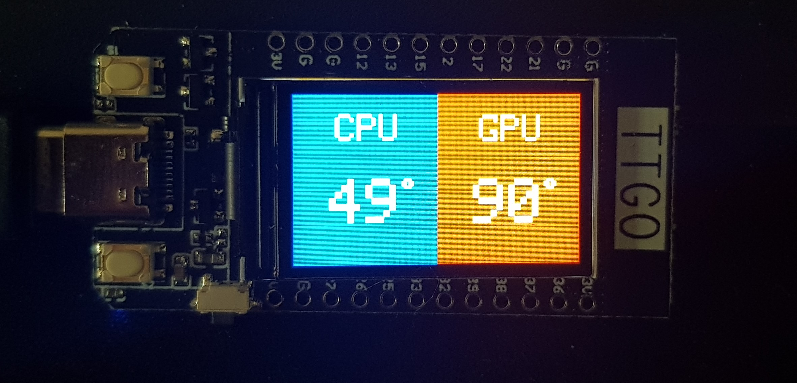

# TTGO - T-Display

PC temperature monitoring

CPU and GPU are displayed in different color rectangle depending of the heat criticity

## I. Hardware

TTGO - T-Display ESP32 Wifi & Bluetooth 1.14 inches LCD

## II. Installation

### Card software
First, we need to add the repo url for the card in Arduino's IDE Preferences.

ESP32 source repo : 
>https://dl.espressif.com/dl/package_esp32_index.json

The used version is  `1.0.4`

### Used libraries

| Library | Version |
| ------ | ------ |
| TFT_espi | `2.2.23` |
| ArduinoJson | `6.17.0`  |
| PathvariableHandlers  | `2.0.0` |
| AsynchttpRequest_generic | `1.0.1` |
| AsyncTCP | https://github.com/me-no-dev/AsyncTCP.git (17oct19)|
| ESPAsyncWebServer | https://github.com/me-no-dev/ESPAsyncWebServer (17oct19) |

### Stack

Open Monitor Hardware launched on :8085 port
Python script getting infos from open Hardware local server and sending it to ESP32.

### Final aspect

